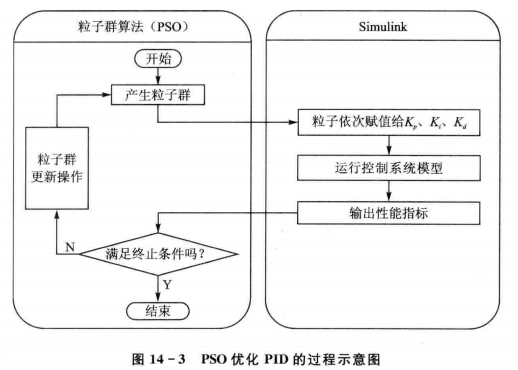
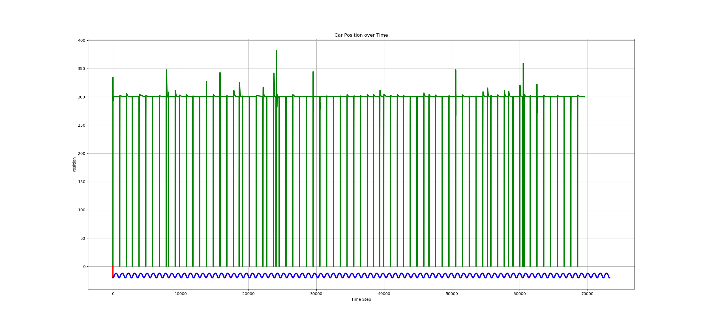

# PSO_PID_param_auto_adjust

## Build
```shell
# 依赖
sudo apt-get install python-matplotlib python-numpy python2.7-dev

# 编译
cd source
./1build_all.sh
```


## 流程
参考：MATLAB智能算法30个案例 




## 性能测试
静态性能测试：步进固定距离 

静态适应度：上升时间（初次到位时间），稳态时间，超调量

 
动态性能测试：跟随指定轨迹移动 

动态适应度：当前时刻 t 位置和 t-1 时刻目标位置的误差 



